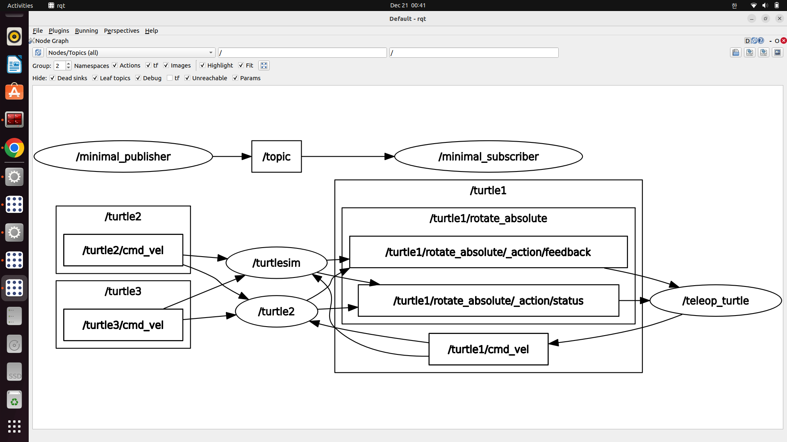

# 2025-12-18 일일 개발 보고서 (Daily Development Report)

**작성자**: MARKCH  
**날짜**: 2025년 12월 18일  
**주제**: ROS2 인터페이스 패키지 생성 및 빌드 시스템 트러블 슈팅

---

# Daily Development Report

## 1. 요약 (Summary)
ROS 2 Humble 개발 환경 구축, Node 간 1:N 토픽 통신 구조 실험, 하드웨어 드라이버(NVIDIA) 및 가상 환경(Anaconda) 최적화.

## 2. 일일 목표 및 계획 (Daily Goals & Plan)
- **목표**: ROS 2 Humble 기반의 안정적인 개발 환경 셋업 및 다중 노드(Multi-node) 통신 원리 파악.
- **총 학습 시간**: 약 7시간 (자율 학습).

## 3. 수행 작업 내용 (Work Performed)
### 코드 개발/구현
- **구현 1: 개발 환경 및 하드웨어 드라이버 최적화**
  - 딥러닝 및 시뮬레이션 활용을 위한 Anaconda 가상 환경 설정.
  - Ubuntu 커널과 충돌 방지를 고려한 NVIDIA 그래픽 드라이버 설치 및 하드웨어 가속 세팅 완료.
- **구현 2: ROS 2 Node 기본 통신 구축**
  - `turtlesim_node`(Subscriber)와 `teleop_turtle`(Publisher) 간의 1:1 토픽(`cmd_vel`) 통신 연결 및 제어 확인.
- **구현 3: 1:N 통신 구조 실험 및 관찰**
  - 동일한 네임스페이스 환경에서 두 번째 `turtlesim_node` 생성.
  - 하나의 `teleop` 노드 입력 시, 두 개의 시뮬레이터가 동시에 반응하는 현상을 통해 토픽의 브로드캐스팅 특성 확인.
  - **실험 결과 자료**:
    - [비디오: 1:N Topic Communication Test](../../src/2025_12_20_ROS2_1toN_Topic_Communication_Test.webm)
    - 

### 디버깅 및 테스트
- **테스트 환경**: Ubuntu 22.04.5 LTS, ROS 2 Humble, CPU i7, GPU GTX 1060, RAM 8GB.
- **이슈 해결**: Anaconda 설치 시 `auto_activate_base` 설정으로 인한 ROS 2 환경 변수 충돌 가능성을 사전 차단 (`.bashrc` 설정 최적화).

### 학습 및 연구
- **토픽(Topic) 통신 특성**: 토픽은 1:1 전용이 아니라, 동일한 토픽 이름을 구독(Subscribe)하는 모든 노드에게 메시지가 전달되는 1:N(또는 N:N) 비동기 통신임을 실험적으로 검증.

## 4. 문제점 및 해결 과정 (Issues & Solutions)
- **문제점 1**: 다중 거북이 제어 시 간섭 발생 (Signal Interference)
  - **현상**: `ros2 run`으로 시뮬레이터를 추가 실행했으나, 별도의 설정 없이 실행하여 모든 거북이가 동일한 `cmd_vel` 토픽을 공유, 동시에 움직이는 현상 발생.
  - **원인 및 해결**: 네임스페이스(Namespace)가 분리되지 않아 발생한 의도치 않은 동작. 향후 리맵핑(Remapping) 또는 네임스페이스 지정을 통해 노드별 독립적 제어 채널 확보 필요.
- **문제점 2**: 시스템 의존성 관리
  - **현상**: Python 버전 관리(Anaconda)와 시스템 Python(ROS 2 의존) 간의 경로 혼동 우려.
  - **해결**: Conda 환경과 ROS 2 환경의 활성화 순서 및 터미널 분리 전략 수립.

## 5. 배운점 및 다음 단계 (Learned & Next Steps)
- **배운점**: ROS 2의 통신 미들웨어(DDS)는 기본적으로 **발행자-구독자(Pub-Sub) 모델**을 따르며, 명시적인 구분(Remap/Namespace) 없이는 메시지가 브로드캐스트된다는 원리를 체득.
- **다음 단계**:
  - 네임스페이스(Namespace)와 리맵핑(Remapping)을 활용한 다중 로봇 개별 제어 구현.
  - Action 통신을 활용한 피드백(Feedback) 제어 심화 학습.

## 6. 레퍼런스 (References)
- Commit Hash: `TODO: 실제 커밋 해시 입력`
- src : 