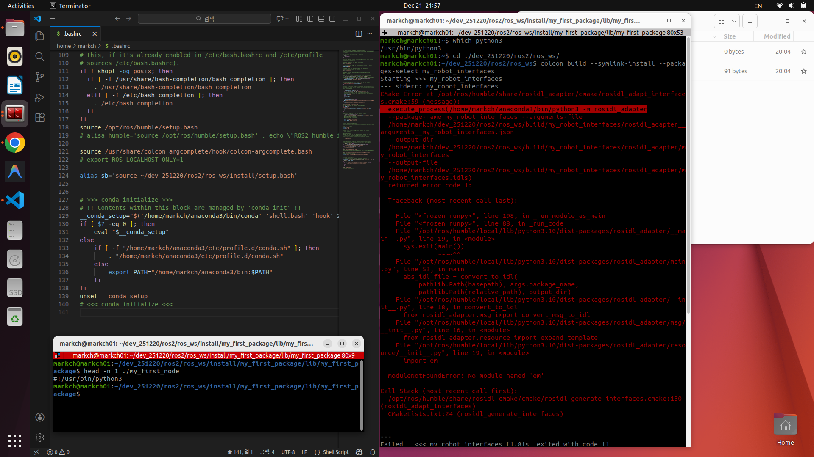

# 2025-12-21 일일 개발 보고서 (Daily Development Report)

**작성자**: MARKCH  
**날짜**: 2025년 12월 21일
**주제**: ROS2 인터페이스 패키지 생성 및 빌드 시스템 트러블 슈팅

---
# 일일 개발 보고서 (Daily Development Report)

## 1. 요약 (Summary)
* **핵심 키워드**: ROS2 Build System (ament_cmake/ament_python), Environment Setup (Overlay/Underlay), Turtlesim, RQt Visualization
* **활동 요약**: `ament_cmake`와 `ament_python`의 빌드 환경 및 경로 충돌 메커니즘 분석, Turtlesim을 이용한 Topic/Service 통신 실습 및 RQt 시각화 진행.

## 2. 일일 목표 및 계획 (Daily Goals & Plan)
* [cite_start]**목표**: ROS2 프로그래밍 기초 및 인터페이스(Topic, Service) 패키지 구조 이해[cite: 1, 1107].
* **세부 계획**:
  * [cite_start]ROS2 빌드 시스템(`ament`) 및 환경 설정 파일(`package.xml`, `setup.py`, `CMakeLists.txt`) 분석[cite: 2838, 2848, 2868].
  * [cite_start]Turtlesim 노드 구동 및 Topic/Service 통신 테스트[cite: 2761, 3328].
  * [cite_start]RQt를 활용한 노드 그래프 시각화 및 디버깅[cite: 2761, 3558].
* **총 학습 시간**: 약 10시간 (추가 학습 포함)

## 3. 수행 작업 내용 (Work Performed)

### 코드 개발/구현
* **구현 1: Turtlesim 노드 및 통신 환경 구축**
  * [cite_start]`turtlesim_node` 실행 및 `turtle_teleop_key`를 이용한 키보드 제어 실습[cite: 2761].
  * [cite_start]`/turtle1/cmd_vel` 토픽을 통한 비동기 단방향 메시지 전송 확인[cite: 2763].
  * `spawn`, `kill` 등의 서비스를 이용한 동기식 양방향 요청/응답 테스트.
* **구현 2: RQt를 이용한 시스템 시각화**
  * [cite_start]`rqt_graph`를 실행하여 노드(Node)와 토픽(Topic) 간의 연결 관계(Graph) 시각화 및 데이터 흐름 검증[cite: 2761].

### 디버깅 및 테스트
* **테스트 환경**: Ubuntu 22.04.5, ROS2 Humble, CPU i7, GPU 1060, RAM 8GB.
* **빌드 시스템 경로 디버깅 (Anaconda 충돌 분석)**:
  * **C++ (`ament_cmake`)**: `CMakeCache.txt` 파일 내 경로 잔존 확인. 빌드 시점의 `PATH` 환경변수를 참조하여 절대 경로가 하드코딩됨을 확인.
  * **Python (`ament_python`)**: 설치된 스크립트(`install/lib/pkg/node`)의 Shebang(`head -n 1`) 확인. 실행 중인 프로세스의 Python 버전을 상속받는 구조임을 규명.

### 학습 및 연구
* **패키지 구조 및 빌드 설정**:
  * [cite_start]`package.xml`: 패키지 의존성 및 메타 정보 정의 (패키지의 신분증 역할)[cite: 2839].
  * [cite_start]`setup.py` vs `CMakeLists.txt`: Python 패키지(배포 설정 위주)와 C++ 패키지(컴파일/링크 설정 위주)의 빌드 설정 파일 차이점 학습[cite: 2891, 2896].

## 4. 문제점 및 해결 과정 (Issues & Solutions)

* **문제점 1: Anaconda 가상환경과 ROS2 빌드 시스템 간 경로 충돌**
  * **현상**: `ament_cmake` 빌드 시 Anaconda 경로 충돌 로그가 발생하나, `ament_python`은 로그 없이 실행됨.
  * **원인**:
    * **C++**: `cmake`가 시스템의 `PATH` 환경변수를 우선순위로 두고 라이브러리를 탐색하며, 이 경로가 `CMakeCache.txt`에 캐싱됨.
    * **Python**: 빌드 시점이 아닌 런타임 프로세스의 Python 인터프리터를 따르거나, 설치 스크립트의 Shebang 라인에 의존함.
  * **해결**: `conda deactivate` 후 빌드 진행하거나, `install/lib` 하위 실행 파일의 Shebang을 확인하여 올바른 Python 인터프리터(`usr/bin/python3` 등)가 지정되었는지 검증.

* **문제점 2: 신규 패키지 실행 불가 (Command Not Found)**
  * **현상**: 패키지 빌드 성공 후 `ros2 run` 명령 실행 시 패키지를 찾을 수 없음.
  * **원인**: ROS2는 Underlay(시스템 설치 경로)와 Overlay(사용자 작업 공간)로 나뉨. [cite_start]터미널의 `.bashrc`는 Underlay만 로드하므로, 새로 빌드된 Overlay 환경 정보가 없음[cite: 2655, 2662].
  * [cite_start]**해결**: 빌드 완료 후 반드시 `source install/setup.bash` 명령어를 통해 오버레이 환경변수를 현재 터미널 세션에 로드함[cite: 2683, 3549].

## 5. 배운점 및 다음 단계 (Learned & Next Steps)

* **배운점**:
  * **빌드 메커니즘**: `ament_cmake`와 `ament_python`이 의존성 경로를 처리하는 방식의 근본적 차이(정적 캐싱 vs 동적/Shebang) 이해.
  * [cite_start]**환경 변수 관리**: Overlay(`local_setup.bash`)와 Underlay(`setup.bash`)의 개념 및 소싱 순서의 중요성 체득[cite: 2674, 2682].
  * [cite_start]**통신 패턴**: 비동기 스트리밍 데이터 처리를 위한 Topic과 상태 변경 및 즉각적 처리를 위한 Service의 명확한 용도 구분[cite: 37, 2193, 2230].
* **다음 단계**:
  * [cite_start]사용자 정의 인터페이스(.msg, .srv)를 포함한 커스텀 패키지 생성 실습[cite: 13, 14].
  * [cite_start]Action 통신 개념 학습 및 액션 서버/클라이언트 구현[cite: 76].

## 6. 레퍼런스 (References)
* ROS2 Documentation: Build System, Turtlesim
* [강의자료] ROS2 프로그래밍 입문 1차시 (ROS2 기초), 2차시 (인터페이스), 3차시 (토픽/서비스)
* **Commit Hash**: 
- **src**:
  - 
  - 
  -  

## 추가사항

CV 모델 학습 중, 윈도우 블루스크린 발생. DFG_watchdog_violation. 데이터 복구 및 오류 처리 진행. 일시적인 충돌 문제로 파악
- 
- [Windows System Restore Log](../../src/2025_12_21_4_Windows_System_Restore_Log.txt)
