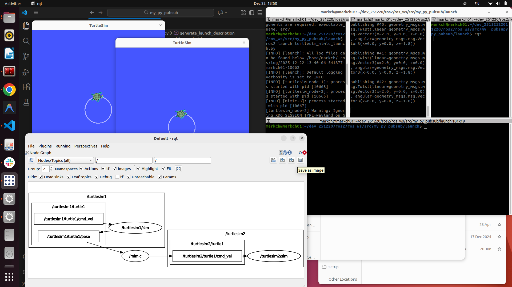

# 2025-12-22 일일 개발 보고서 (Daily Development Report)

**작성자**: MARKCH  
**날짜**: 2025년 12월 22일

## 1. 요약 (Summary)
**`rclpy` 서비스 구현**, **ROS2 Launch 시스템 구축**, **Topic Remapping 적용**, **Launch 트러블슈팅**

## 2. 일일 목표 및 계획 (Daily Goals & Plan)
* **학습 목표**: ROS2 Python 클라이언트(`rclpy`) 구조 이해 및 Executor 활용, Launch 시스템을 이용한 노드 실행 제어 학습.
* **소요 시간**: 약 7시간 (이론 학습 및 실습 병행)

## 3. 수행 작업 내용 (Work Performed)
### 코드 개발/구현
* **구현 1: rclpy 서비스 서버/클라이언트 구현**
  - `rclpy` 라이브러리를 활용하여 사칙연산 서비스 로직 구현.
  - `example_interfaces`를 사용하여 서비스 타입 정의 및 연산 중 **ZeroDivisionError** 예외 처리 로직 추가.
* **구현 2: Launch 시스템 및 Remapping 적용**
  - Python 기반의 Launch 파일(`*.launch.py`) 작성 및 `generate_launch_description` 함수 구성.
  - `mimic` 노드를 런치 파일에 포함시키고, `remappings` 옵션을 사용하여 `/input/pose`를 `/turtlesim1/turtle1/pose`로 변경, 다중 거북이 제어 환경 구축.
* **구현 3: 패키지 빌드 설정 (Launch 포함)**
  - `package.xml`, `setup.py`, `launch.py` 간의 의존성 및 경로 설정 확인.
  - `PathJoinSubstitution`을 활용하여 패키지 경로와 런치 파일 경로를 동적으로 연결하는 로직 구현.

### 디버깅 및 테스트
* **테스트 환경**: Ubuntu 22.04.5 LTS, ROS2 Humble, CPU i7, GPU 1060, RAM 8GB.
* **Launch Substitution 디버깅**:
  - `ExecuteProcess`를 통해 `/Spawn` 서비스를 호출하는 과정에서 인자 전달 오류 수정.
  - 서비스 호출 시 패키지/메시지 타입 지정 관련 `turtlesim_msgs`와 `turtlesim` 혼동 문제 해결 및 정상 동작 확인.
* **패키지 설치 경로 이슈 (Page 27 관련)**:
  - 런치 파일 작성 후 `ros2 launch` 실행 시 파일을 찾지 못하는 현상 발생.
  - `setup.py` 내 `data_files` 설정 누락 확인 및 수정하여 `install/share` 경로에 정상 복사되도록 조치 완료.

### 학습 및 연구
* **Executor 모델**: SingleThreadedExecutor와 MultiThreadedExecutor의 차이점 및 콜백 실행 순서(Wait-Take-Execute) 이해.
* **Launch 아키텍처**: 단순 노드 실행을 넘어선 시스템 설정(파라미터, 네임스페이스, 이벤트 핸들링) 관리 도구로서의 Launch 역할 숙지.

## 4. 문제점 및 해결 과정 (Issues & Solutions)
* **문제점 1**: Launch 실행 시 `package not found` 또는 `file not found` 오류 발생.
  - **원인 및 해결**: `setup.py`의 `data_files` 항목에 런치 폴더 경로(`glob` 패턴)가 정확히 명시되지 않아 빌드 시 설치 폴더로 복사되지 않음. `(os.path.join('share', package_name, 'launch'), glob('launch/*.launch.py'))` 구문 추가 및 재빌드(`colcon build`) 후 `source` 적용으로 해결.
* **문제점 2**: RViz 실행 불가 및 TF2 관련 오류 (16:13 발생).
  - **원인 및 해결**: 패키지명을 수정했음에도 `tf2` 관련 패키지를 찾을 수 없다는 에러 발생. `turtle_tf2_py` 등 튜토리얼 의존성 패키지 미설치가 원인으로 파악됨. `sudo apt install ros-humble-turtle-tf2-py` 등 관련 패키지 설치 진행 필요 (미해결 상태로 다음 단계 이관).

## 5. 배운점 및 다음 단계 (Learned & Next Steps)
* **배운점**:
  - Launch 파일은 단순 스크립트가 아니라 `setup.py`를 통해 시스템 경로에 설치되어야만 `ros2 launch` 명령어로 호출 가능하다는 점.
  - Launch Substitution을 사용하면 하드코딩 없이 동적으로 패키지 경로와 변수를 조합할 수 있어 유지보수성이 향상된다는 점.
* **다음 단계**:
  - TF2 관련 의존성 패키지 설치 및 RViz 연동 실습 완료.
  - Launch 파일 내에서 조건부 실행(`IfCondition`) 및 이벤트 핸들러 심화 학습.

## 6. 레퍼런스 (References)
* Commit Hash:
- [Windows System Restore Log](../../src/2025_12_21_4_Windows_System_Restore_Log.txt)
- **New docs**: [2025_12_22_ROS2_Arithmetic_Service](../../docs/2025_12_22_ROS2_Arithmetic_Service)
- **New src**:
  - 
  - 