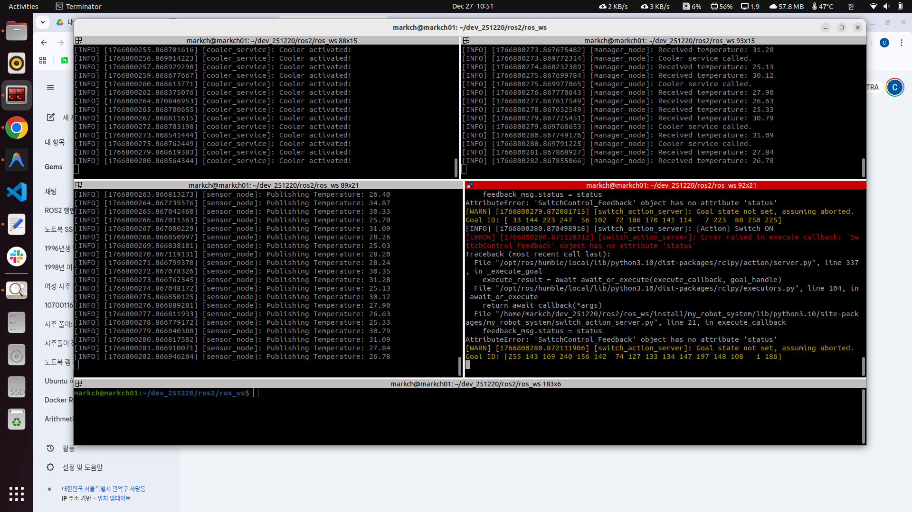
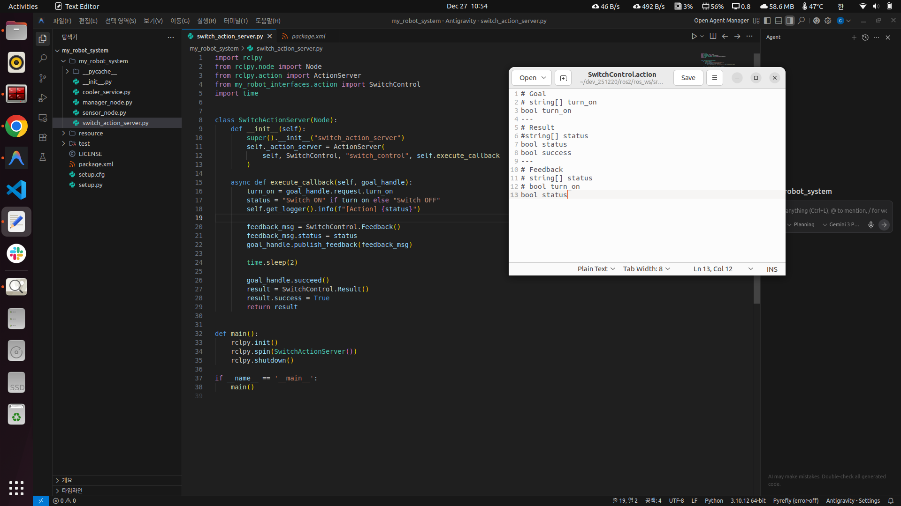
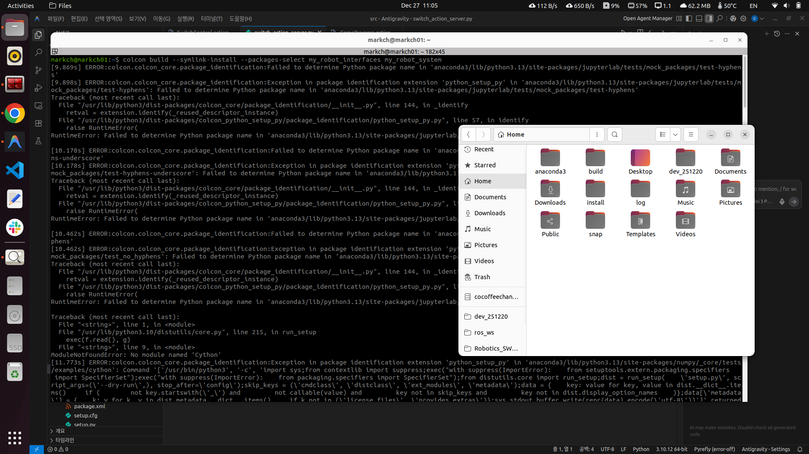
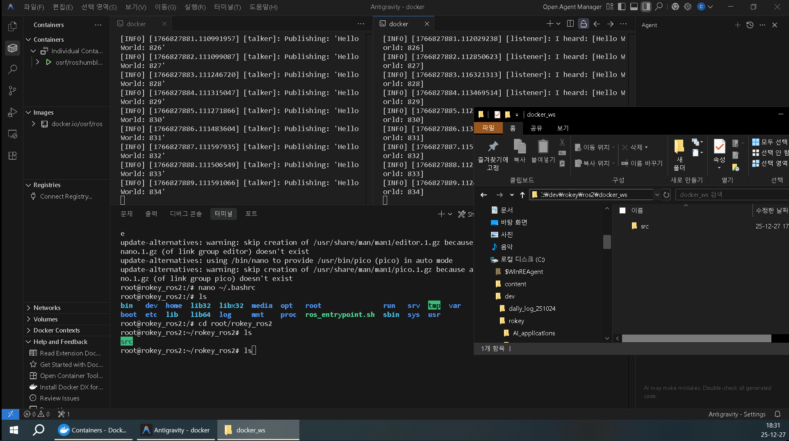

# 일일 개발 보고서 (Daily Development Report)

**작성자:** MARKCH
**작성일:** 2025년 12월 27일
**주제:** Docker 기반 ROS2 환경 구축 및 Action Interface 디버깅

## 1. 요약 (Summary)
* Windows 10 기반 **Docker ROS2 Humble 개발 환경(Container)** 구축 및 볼륨 마운트 설정.
* `demo_nodes` 및 `ros2 doctor`를 활용한 컨테이너 내부 통신 상태 검증.
* Action Interface(`.action`)의 Feedback 필드 타입 불일치 수정 및 **DDS Payload Size** 에러 분석.

## 2. 일일 목표 및 계획 (Daily Goals & Plan)
* **Docker 환경 구축**: `osrf/ros:humble-desktop-full-jammy` 이미지를 활용한 독립 개발 환경 구성.
* **볼륨 연동**: 로컬 호스트(`docker_ws`)와 컨테이너(`rokey_ros2`) 간 파일 시스템 동기화 및 작업 효율성 확보.
* **Action Interface 디버깅**: 커스텀 Action 정의 파일 수정 및 빌드, 실행 중 발생하는 타입 에러 및 미들웨어(DDS) 에러 해결.

## 3. 수행 작업 내용 (Work Performed)

### 코드 개발/구현
* **구현 1: Docker 기반 ROS2 개발 환경 구성**
  * OSRF 공식 이미지(`osrf/ros:humble-desktop-full-jammy`) 풀(Pull) 및 컨테이너 생성.
  * 개발 편의성을 위해 로컬 작업 디렉토리와 컨테이너 내부 워크스페이스를 연동하는 Volume 마운트 적용.
    * Mapping: `Host: .../docker_ws` ↔ `Container: /root/rokey_ros2`
* **구현 2: 통신 미들웨어 검증**
  * `ros2 run demo_nodes_cpp talker` 및 `demo_nodes_py listener`를 활용한 Pub/Sub 통신 테스트 수행.
  * `ros2 doctor` 명령어를 통해 네트워크 설정 및 패키지 의존성 상태 정상 확인.
* **구현 3: Action Interface 수정 및 적용**
  * `switch_action_server` 노드에서 사용하는 `.action` 파일의 Feedback 섹션 구조 변경 테스트.
  * 데이터 타입 변경 실험: `string[]` → `bool` → `string` 순으로 변경하며 빌드 및 테스트 진행.

### 디버깅 및 테스트
* **테스트 환경**: Windows 10 Host / Docker Container (Ubuntu 22.04.5, ROS2 Humble)
  * H/W: CPU i7, GPU 1060, RAM 8GB
* **이슈 해결**:
  * Action Server 실행 시 Feedback 타입 불일치로 인한 콜백 에러 디버깅.
  * Action 노드 정상화 후 Manager 노드에서 발생한 RTPS History Payload 에러 분석.

### 학습 및 연구
* **Docker Volume 전략**: 컨테이너의 휘발성(Volatility)을 보완하기 위해 소스 코드를 로컬에 저장하고, 빌드 및 실행 환경만 컨테이너를 사용하는 하이브리드 워크플로우 확립.
* **ROS2 IDL 타입 엄격성**: `.action` 파일에 정의된 데이터 타입과 실제 코드(C++/Python)에서 다루는 변수 타입이 정확히 일치해야 직렬화(Serialization) 오류가 발생하지 않음.

## 4. 문제점 및 해결 과정 (Issues & Solutions)

* **문제점 1: Action Feedback 타입 불일치 에러**
  * **현상**: Action Server 실행 시 `[ERROR] ... Error raised in execute callback: The 'status' field must be of type 'bool'` 메시지 발생.
  * **원인**: `.action` 파일의 Feedback 정의가 `string[] status`였으나, 실제 코드 로직이나 테스트 과정에서 단일 `bool` 값 전송을 시도하여 타입 불일치 발생.
  * **해결**:
    1. `bool status`로 변경 시도 → 여전히 에러 발생 (코드 로직과의 불일치 추정).
    2. `string status` (단일 문자열)로 변경 후 재빌드 → **정상 출력 확인**.

* **문제점 2: RTPS Reader History Payload 에러**
  * **현상**: Action 노드 정상화 직후, Manager 노드에서 `[RTPS_READER_HISTORY Error] Change payload size of '36' bytes is larger than the history payload size of '27' bytes` 에러 발생.
  * **원인**: DDS(FastDDS 등) 계층에서 이전에 할당된 History Cache의 페이로드 크기(27 bytes)보다 더 큰 데이터(36 bytes)가 들어와 리사이징에 실패함. 주로 메시지 타입 변경 후 이전 빌드 캐시가 남았거나 QoS 설정이 타이트할 때 발생.
  * **해결(진행 중)**: `colcon build --symlink-install` 재수행 및 `build/`, `install/` 폴더 삭제 후 클린 빌드 시도 필요. 혹은 QoS Profile에서 History Depth 조정 검토.

## 5. 배운점 및 다음 단계 (Learned & Next Steps)
* **배운점**:
  * **환경 격리(Isolation)**: Docker를 활용하면 Host OS(Windows)의 영향을 받지 않고 순정 리눅스 환경과 동일하게 ROS2 개발이 가능함을 확인.
  * **DDS 민감도**: 메시지(Interface) 정의를 수정했을 때, 단순히 코드만 고치는 것이 아니라 미들웨어단의 캐시나 QoS 설정(History payload)까지 고려해야 함을 학습.
* **다음 단계**:
  * RTPS Payload Error 완전 해결을 위한 QoS 정책(Reliability, History) 튜닝.
  * Docker 컨테이너를 이미지로 커밋(Commit)하여 배포 가능한 상태로 패키징.

## 6. 레퍼런스 (References)
**commit** : my_robot_system의 switch action server 디버깅, docker image로 ubuntu 및 ros2 환경설정
**src**
- 
- 
- 
- [Manager Node RTPS Error Log](../../src/2025_12_27_4_Manager_Node_RTPS_Error_Log.webm)
- 
- 
- 
- 
- 
