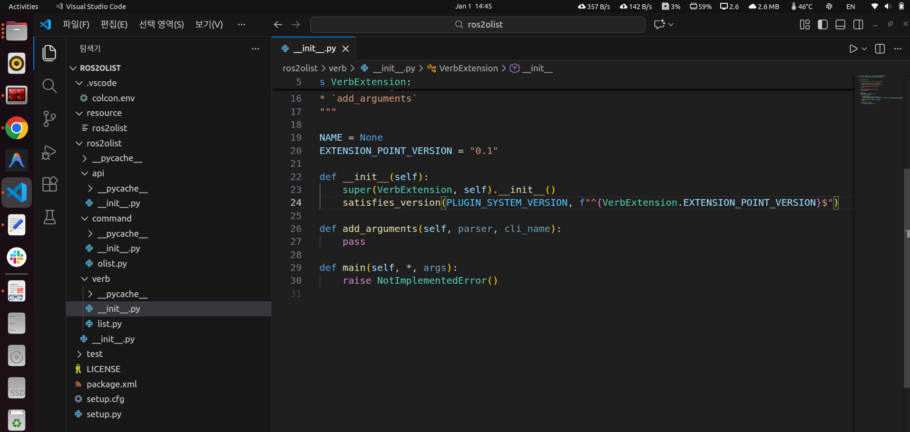
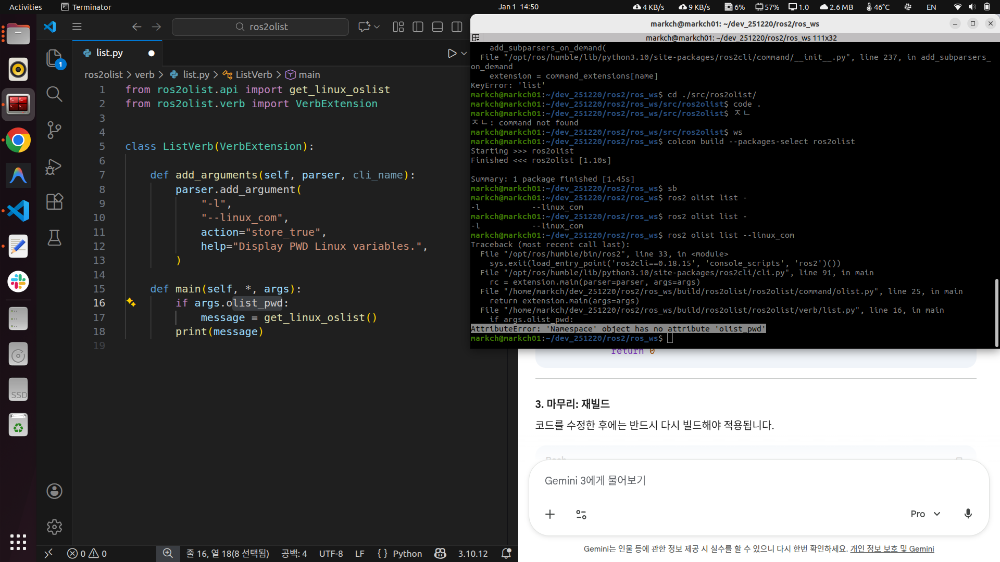

# 2026-01-01 일일 개발 보고서

## 1. 요약 (Summary)
ROS2 Custom CLI 명령어(`olist`) 구현 및 엔트리 포인트 설정 실습 수행. ROS2 미들웨어(DDS) 레벨에서의 Topic 통신 과정(Discovery, Matching)을 심층 분석하고, QoS 설정 및 Single Thread 환경에서의 Blocking 현상에 대한 원리를 규명함.

## 2. 일일 목표 및 계획 (Daily Goals & Plan)
* **목표**: ROS2 패키지 구조 이해 및 Custom CLI 툴 개발, Topic 통신 심화 이론(DDS 동작 원리) 학습
* **소요 시간**: 약 7시간 (이론 학습 및 디버깅 포함)

## 3. 수행 작업 내용 (Work Performed)
### 코드 개발/구현
* **구현 1: ROS2 CLI 커스텀 명령어(`ros2 olist`) 개발**
  * `setup.py`의 `entry_points` 설정을 통해 `ros2 olist list -l` 명령어 호출 구조 구현.
  * `main` 함수의 `args` 인자 파싱 로직 구현 및 커맨드 라인 인터페이스 연동.
* **구현 2: Topic 통신 메커니즘 분석**
  * **Discovery 단계**: DDS의 Multicast(Broadcasting)를 통해 Publisher와 Subscriber의 존재 여부(Existence) 확인 과정 도식화.
  * **Matching 단계**: Topic Name, Message Type, QoS(Quality of Service) 호환성 검증을 통한 논리적 연결(Connecting) 과정 정리.

### 디버깅 및 테스트
* **테스트 환경**:
  * H/W: MSI GE72 (i7 CPU, GTX 1060, 8GB RAM)
  * OS: Windows 10 Host (WSL2 + Docker / Ubuntu 22.04.5 LTS, ROS2 Humble)
* **이슈 해결**:
  * 패키지 빌드 시 버전 확인 충돌 오류 발생 확인 및 수정.
  * `main` 함수 인자 전달 과정에서의 타입 불일치 및 구문 에러 수정.

### 학습 및 연구
* **Blocking 메커니즘 연구**:
  * SingleThreadedExecutor 사용 시, `Callback 처리 시간 > Timer 주기`인 경우 발생하는 Blocking 현상 분석.
  * 이벤트 큐(Queue)와 실행기(Executor)의 동작 관계 파악.
* **QoS 정책 심화**:
  * `KEEP_LAST`와 Ring Buffer 구조의 상관관계 이해.
  * Buffer Overflow 시 오래된 데이터(Oldest)가 Overwrite(Drop)되는 메커니즘 확인.

## 4. 문제점 및 해결 과정 (Issues & Solutions)
* **문제점 1**: 코드 작성 중 구문 오류(setup.py의 entry_point, api, list 디렉터리 경로 확인 및 수정 등 변수명 설정 및 쉘 커맨드 작성 중 오타(`$`)로 인한 빌드 실패.
  * **현상**: 파이썬 스크립트 실행 불가 및 Syntax Error 발생.
  * **원인**: 변수명 또는 쉘 커맨드 작성 중 오타(`$`)가 포함됨.
  * **해결**: 코드 리뷰를 통해 오타 검출(`$`) 및 수정 후 재빌드(`colcon build`) 성공.
* **문제점 2**: CLI 명령어 실행 시 인자 전달 실패.
  * **현상**: `ros2 olist` 실행 시 `main` 함수 진입 불가 또는 인자값 누락.
  * **원인**: `main(args=None)` 정의 및 `rclpy.init(args=args)` 초기화 과정에서의 인자 처리 미흡.
  * **해결**: `sys.argv` 처리 로직 보완 및 `entry_points`와 `main` 함수 간의 연결성 검증 완료.

## 5. 배운점 및 다음 단계 (Learned & Next Steps)
* **배운점**:
  * **Discovery vs Matching**: Discovery는 물리적/네트워크적 존재 확인(Broadcasting)이며, Matching은 논리적 조건(Name, Type, QoS)의 체결임을 명확히 구분함.
  * **Real-time Constraint**: 실시간 제어에서 Latency를 줄이기 위해 `KEEP_LAST` 정책과 적절한 Depth 설정이 중요함을 깨달음.
  * **Blocking**: Timer 주기가 1초라도 작업 시간이 1.5초라면, 전체 주기가 1.5초로 밀리는 현상(Blocking)을 이해함.
* **다음 단계**:
  * Service 및 Action 통신 구현을 통한 양방향/장기 작업 처리 학습.
  * MultiThreadedExecutor를 활용하여 Blocking 현상을 해소하는 병렬 처리 구현.

## 6. 레퍼런스 (References)
**commit**: ros2 cli 명령어 생성 및 topic 패키지 생성 리뷰
**src**

