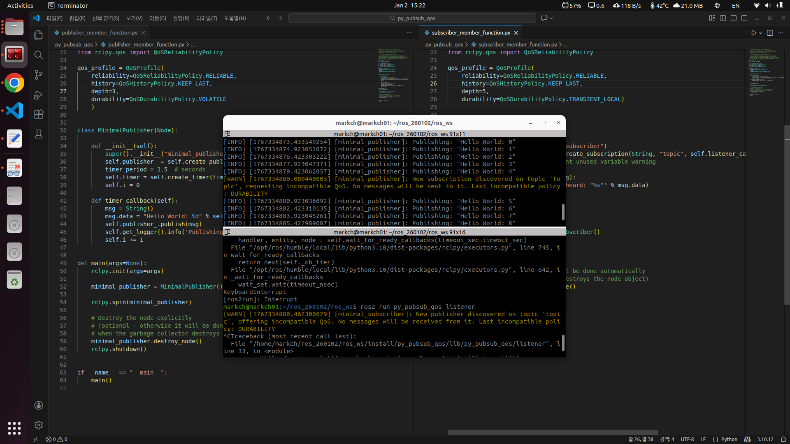

## 일일 개발 보고서 (Daily Development Report)

**작성자**: MARKCH
**날짜**: 2026-01-02

## 1. 요약 (Summary)
* ROS2 **IPC(Intra-Process Communication)** 및 **Zero-Copy** 메커니즘 실습
* **QoS(Quality of Service)** 프로파일 6가지 항목(History, Reliability, Durability 등) 이해 및 적용
* Publisher/Subscriber 간 **QoS 호환성(Compatibility)** 테스트 및 디버깅

## 2. 일일 목표 및 계획 (Daily Goals & Plan)
* **목표**: 단일 컴퓨팅 시스템 내 노드 간 통신 최적화(IPC) 기법 습득 및 네트워크 환경에 따른 QoS 설정 능력 배양
* **학습 시간**: 7시간 (실습 및 디버깅 포함)
* **주요 주제**: Intra-Process Communication, QoS Policies (History, Reliability, Durability, Deadline, Lifespan, Liveliness)

## 3. 수행 작업 내용 (Work Performed)

### 코드 개발/구현
* **구현 1: Intra-Process Communication 실습**
  * `intra_process_demo` 패키지의 `image_pipeline_all_in_one` 실행을 통한 Zero-Copy 동작 확인.
  * 동일 프로세스 내 노드(`camera_node`, `watermark_node`) 간 메모리 주소(ptr) 일치 여부 및 PID 확인.
* **구현 2: QoS 프로파일 커스터마이징**
  * `py_pubsub` 패키지를 활용하여 `QoSProfile` 객체 생성 및 적용.
  * `History`(`KEEP_LAST`, `KEEP_ALL`) 및 `Depth` 설정 변경에 따른 메시지 보관 정책 차이 분석.

### 디버깅 및 테스트
* **테스트 환경**: Ubuntu 22.04.5, ROS2 Humble, CPU i7, GPU 1060, RAM 8GB
* **이슈 해결**:
  * OpenCV 기반 `image_view_node` 실행 시 GStreamer 경고 로그 분석.
  * GUI 창 종료 시 지속적인 재실행 현상에 대한 프로세스 구조 분석.
  * Publisher와 Subscriber 간 QoS 정책 불일치로 인한 통신 장애 테스트.

### 학습 및 연구
* **IPC 이론**: 단일 시스템 내 데이터 복사 오버헤드를 줄이기 위한 공유 메모리(SHM) 기반 Zero-Copy 기술 학습.
* **QoS 정책**: 데이터 전송 신뢰성(`RELIABLE` vs `BEST_EFFORT`)과 내구성(`TRANSIENT_LOCAL` vs `VOLATILE`)의 개념 및 활용 사례 연구.

## 4. 문제점 및 해결 과정 (Issues & Solutions)

* **문제점 1: GStreamer Warning 발생**
  * **현상**: `ros2 run intra_process_demo image_pipeline_all_in_one` 실행 시 `Cannot query video position: status=0, value=-1, duration=-1` 경고 발생.
  * **원인**: 웹캠 스트리밍 데이터는 전체 재생 길이(Duration)가 존재하지 않으나, GStreamer가 이를 쿼리 하려다 실패하여 발생하는 비치명적 경고.
  * **해결**: 기능 동작에 영향이 없음을 확인하고 무시(Ignore) 처리. 정상적으로 메모리 주소(ptr) 및 PID가 출력됨을 확인.

* **문제점 2: Image View 창 무한 재실행**
  * **현상**: 이미지 뷰어 창의 'X' 버튼을 눌러 종료해도 즉시 새 창이 생성됨.
  * **원인**: 단일 프로세스 내에서 `camera_node`가 지속적으로 데이터를 퍼블리시하고 있으며, `image_view_node`는 수신된 데이터에 반응하여 GUI 스레드를 트리거하기 때문.
  * **해결**: GUI 창 닫기가 아닌 터미널에서 `Ctrl+C`를 입력하여 부모 프로세스 자체를 종료.

* **문제점 3: QoS Durability 호환성 오류**
  * **현상**: Publisher(`VOLATILE`)와 Subscriber(`TRANSIENT_LOCAL`) 조합 시 통신이 원활하지 않거나 데이터 수신 불가 현상 발생. (반면, 단순 Depth 차이는 문제없음)
  * **원인**: ROS2 QoS 호환성 규칙상 **Publisher가 제공하는 품질(Offer) >= Subscriber가 요청하는 품질(Request)**이어야 함. Subscriber가 "과거 데이터 필요(`TRANSIENT_LOCAL`)"를 요청했으나, Publisher가 "저장 안 함(`VOLATILE`)"으로 설정되어 요구사항 불충족(Incompatible).
  * **해결**: Subscriber의 `Durability`를 `VOLATILE`로 낮추거나, Publisher를 `TRANSIENT_LOCAL`로 상향 조정하여 호환성 확보.

## 5. 배운점 및 다음 단계 (Learned & Next Steps)
* **배운점**:
  * ROS2의 통신은 단순 연결이 아니라 QoS 정책(특히 Reliability와 Durability)의 **Rx/Tx 호환성(Compatibility)**이 엄격하게 적용됨을 체득.
  * IPC를 활용하면 대용량 이미지 데이터 전송 시 직렬화/역직렬화 비용 없이 포인터(참조) 전달만으로 고성능 통신이 가능함.
* **다음 단계**:
  * 다양한 DDS 벤더(Fast DDS, Cyclone DDS) 변경에 따른 QoS 동작 차이 심화 분석.
  * Action 통신에서의 QoS 적용 및 실제 로봇 제어 시나리오 시뮬레이션.

## 6. 레퍼런스 (References)
**commit**: IPC와 QoS 학습
**src**: 
