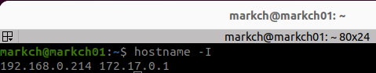
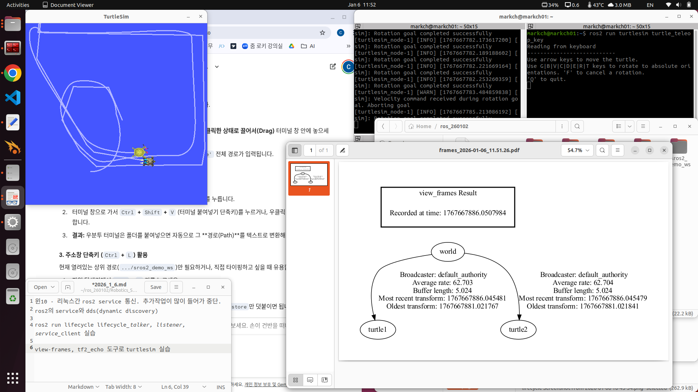
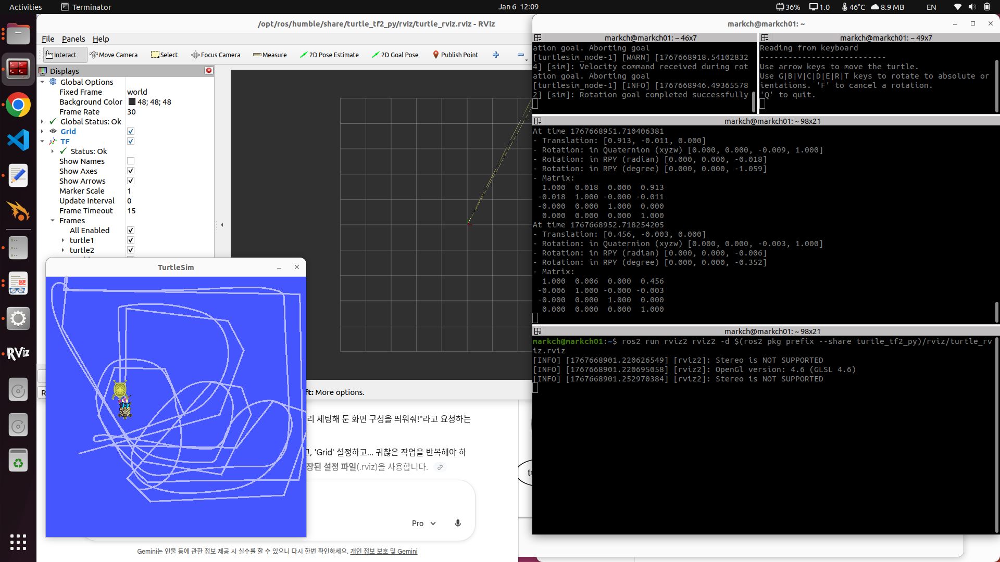

# 일일 개발 보고서 (Daily Development Report)

## 1. 요약 (Summary)
* **ROS2 Lifecycle Management**
* **TF2 (Transform Library)**
* **URDF & Robot State Publisher**
* **DDS Communication (Service)**

## 2. 일일 목표 및 계획 (Daily Goals & Plan)
* **주요 목표**: ROS2 심화 기능인 노드 생명주기(Lifecycle) 관리, 좌표 변환(TF2), 로봇 모델링(URDF)의 이론 학습 및 실습 진행.
* **총 학습 시간**: 약 7시간

## 3. 수행 작업 내용 (Work Performed)

### 코드 개발/구현
* **구현 1: Lifecycle Node 제어 실습**
    * `lifecycle_talker`, `lifecycle_listener`, `lifecycle_service_client` 패키지를 활용한 노드 구동.
    * CLI 명령어를 통해 Unconfigured → Inactive → Active 상태 전이(Transition) 과정 검증.
    * 각 상태별 콜백 함수(`on_configure`, `on_activate` 등)의 호출 시점 및 동작 로직 확인.
* **구현 2: TF2 도구를 활용한 좌표계 분석**
    * `turtlesim` 기반의 `turtle_tf2_demo`를 실행하여 좌표 프레임 브로드캐스팅 환경 구성.
    * `view_frames` 도구를 사용하여 현재 TF 트리를 PDF 다이어그램으로 시각화 및 부모-자식 프레임 관계(World → Turtle) 분석.
    * `tf2_echo`를 통해 `turtle2`와 `turtle1` 간의 실시간 좌표 변환(Translation/Rotation) 데이터 모니터링.
* **구현 3: URDF 기반 로봇 모델링 및 상태 퍼블리싱**
    * `urdf_revolution` 패키지 실습을 통해 URDF 파일과 `state_publisher` 노드 연동.
    * `joint_state_publisher`와 GUI 슬라이더를 활용하여 로봇의 관절(`revolute`, `prismatic`) 제어.
    * Python 스크립트 내에서 `tilt`, `height`, `swivel` 파라미터 제어 로직을 통해 로봇의 동적 움직임 구현.

### 디버깅 및 테스트
* **테스트 환경**: Ubuntu 22.04.5, ROS2 Humble, CPU i7, GPU 1060, RAM 8GB (메모 기반).
* **이슈 해결**:
    * **URDF 렌더링 확인**: RViz2에서 `RobotModel` 디스플레이가 정상적으로 표시되지 않는 현상에 대해 `Fixed Frame`을 `base_link` 또는 `odom`으로 설정하여 해결.

### 학습 및 연구
* **Lifecycle Node**: 노드의 상태를 명시적으로 관리(Managed Node)하여 시스템의 결정론적(Deterministic) 시작과 종료를 보장하는 메커니즘 학습.
* **TF2 & Tree**: 로봇 시스템 내 다수 좌표계(Map, Odom, Base_link 등) 간의 상대적 변환 관계를 트리 구조로 관리하는 원리 이해.
* **URDF & Xacro**: XML 형식을 이용한 로봇의 물리적 형상 정의 및 Xacro 매크로를 이용한 코드 재사용성 증대 방법 학습.

## 4. 문제점 및 해결 과정 (Issues & Solutions)
* **문제점 1**: Windows 10(Host) - Linux(Guest/Dual) 간 ROS2 Service 통신 실패
    * **현상**: `ros2 service call` 실행 시 응답이 없거나, 노드 간 Discovery가 간헐적으로 실패함.
    * **원인 및 해결**:
        * **원인**: OS 간 네트워크 인터페이스 처리 방식 차이 및 방화벽 설정 문제로 인한 DDS(Data Distribution Service) 멀티캐스트 패킷 손실. XML 설정을 통한 DDS 튜닝이 필요하나 복잡도가 높음.
        * **해결**: 실습 효율성을 위해 이기종 OS 간 통신 시도를 중단(Suspend)하고, Ubuntu 단일 환경에서의 Service 통신 실습으로 전환하여 학습 목표 달성.

## 5. 배운점 및 다음 단계 (Learned & Next Steps)
* **배운점**:
    * **상태 관리의 중요성**: Lifecycle Node를 통해 센서나 액추에이터 같은 하드웨어 리소스를 안전하게 초기화(`configure`)하고 정리(`cleanup`)하는 패턴을 익힘.
    * **TF의 시각화**: 눈에 보이지 않는 좌표 변환 데이터를 `view_frames`와 RViz를 통해 시각화함으로써 디버깅하는 역량 확보.
* **다음 단계**:
    * URDF에 Xacro를 본격적으로 적용하여 로봇 모델 코드 최적화.
    * Gazebo 시뮬레이터와 연동하여 물리 엔진이 적용된 로봇 제어 실습.

## 6. 참고 자료 (References)
* **Commit Hash**: lifecycle, tf2, urdf 실습

* **IP 설정 확인**: 
* **Lifecycle Node 관리**: 
* **TF2 View Frames 실습**: 
* **TF2 & Rviz2 상대좌표**: 
* **Plugin 시스템 상세**: 

